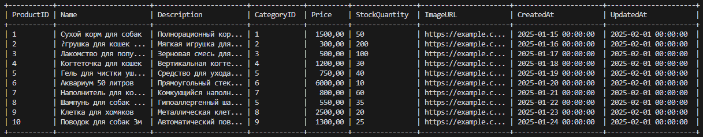

# Отчет о лабораторной работе

## Цель работы
- Создание каркаса Spring-приложения для магазина товаров для животных с использованием Gradle. 
- Изучение конфигурирования Spring приложений на основе Java-классов. 
- Реализация загрузчика CSV файлов с товарами и вывод их в консоль в виде таблицы.

## Выполнение работы
### 1. Установка необходимого программного обеспечения:
- Установлен Temurin JDK 17.0.14
- Установлен Gradle 8.12


### 2. Создание проекта с помощью Gradle:
- Создан проект с параметрами:
  + Пакет: ru.bsuedu.cad.lab
  + Имя проекта: employee-table
  + Тип: Application
  + Язык: Java
  + Версия Java: 17
  + Структура: Single application project
  + DSL: Kotlin
  + Тестовый фреймворк: JUnit Jupiter

### 3. Добавление зависимостей:
- Добавлена [библиотека Spring Context 6.2.2](project/app/build.gradle.kts) 

```kts
implementation(libs.spring.context)
```
+ Настроена версия в [libs.versions.toml](project/gradle/libs.versions.toml)
```toml
[versions]
spring-context="6.2.2"

[libraries]
spring-context = { module = "org.springframework:spring-context", version.ref = "spring-context" }
```


### 4. Реализация структуры приложения:
- Созданы классы согласно диаграмме классов
- Реализованы интерфейсы и их реализации

### 5. Реализация функциональности:
- Реализован [загрузчик CSV файлов](project/app/src/main/java/ru/bsuedu/cad/lab/io/ResourceFileReader.java)
- Реализован [парсер CSV](project/app/src/main/java/ru/bsuedu/cad/lab/parser/CSVParser.java)
- Реализован [вывод данных в виде таблицы](project/app/src/main/java/ru/bsuedu/cad/lab/renderer/ConsoleTableRenderer.java)

### 6. Запуск приложения:
- Приложение успешно запускается командой `gradle run`
- Выводит данные в виде таблицы


## Выводы
1. Успешно создан каркас Spring-приложения для магазина товаров для животных с использованием Gradle
2. Освоены основы конфигурирования Spring приложений на основе Java-классов
3. Реализован функционал загрузки и обработки CSV файлов с товарами
4. Разработана система вывода данных в консоль в виде таблицы
5. Приложение успешно запускается и выполняет поставленные задачи


