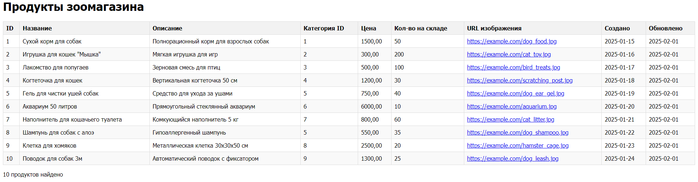
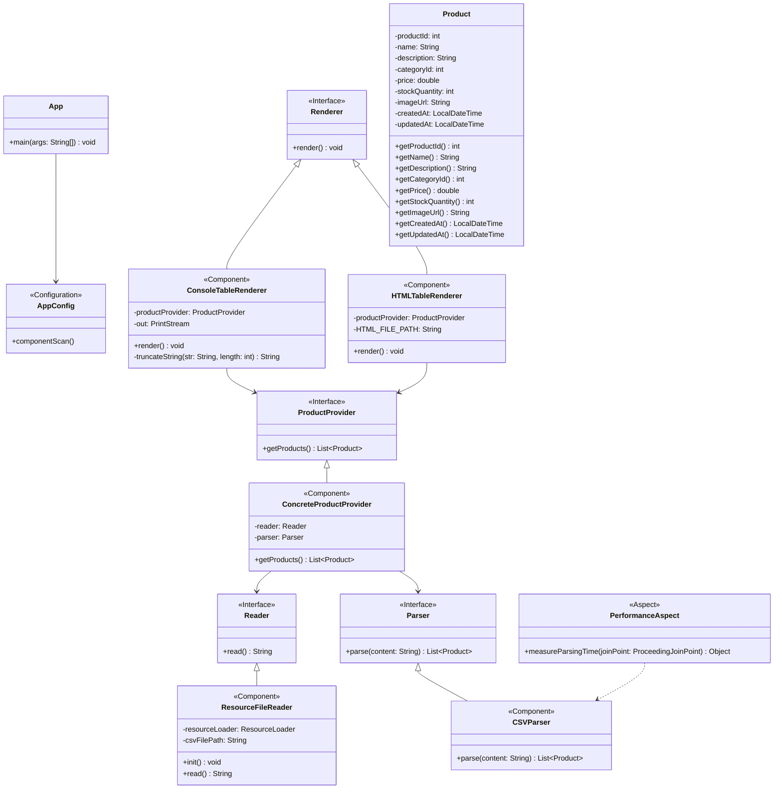

# Отчет о лабораторной работе 2

## Цель работы
- Переконфигурирование приложения Spring c помощью аннотаций
- Применение аспектно-ориентированного программирования (АОП) для логирования и измерения производительности
- Создание HTML-представления таблицы с товарами

## Выполнение работы
### 1. Перенос проекта из предыдущей лабораторной работы:
- Скопирован проект из лабораторной работы №1 в директорию `/les04/lab/`
- Сохранена вся структура проекта и зависимости

### 2. Переконфигурирование приложения с помощью аннотаций:
- Заменены конфигурации в XML на аннотации `@Component` для всех компонентов приложения
- Добавлена конфигурация с помощью класса `AppConfig` с аннотацией `@Configuration`
- Настроено автоматическое сканирование компонентов с помощью `@ComponentScan`

### 3. Настройка загрузки параметров из файла конфигурации:
- Создан конфигурационный файл `application.properties` в каталоге ресурсов
- Добавлено получение имени файла для загрузки продуктов с помощью аннотации `@Value` и SpEL
```java
@Value("${csv.file.path}")
private String csvFilePath;
```

### 4. Добавление HTML-рендерера таблицы:
- Реализован новый класс `HTMLTableRenderer`, реализующий интерфейс `Renderer`
- Добавлена аннотация `@Primary` для приоритетного использования HTML-рендерера
- Настроено форматирование HTML-таблицы со стилями CSS

### 5. Отслеживание жизненного цикла бинов:
- Добавлен метод инициализации для бина `ResourceFileReader` с аннотацией `@PostConstruct`
- Реализован вывод в консоль даты и времени инициализации бина

### 6. Применение АОП для измерения производительности:
- Добавлены зависимости для работы с АОП Spring
- Создан аспект `PerformanceAspect` с аннотацией `@Aspect`
- Реализован метод для измерения времени выполнения парсинга CSV-файла:
```java
@Around("execution(* ru.bsuedu.cad.lab.parser.CSVParser.parse(..))")
public Object measureParsingTime(ProceedingJoinPoint joinPoint) throws Throwable {
    long startTime = System.currentTimeMillis();
    Object result = joinPoint.proceed();
    long endTime = System.currentTimeMillis();
    System.out.println("Время парсинга CSV-файла: " + (endTime - startTime) + " мс");
    return result;
}
```

### 7. Запуск приложения:
- Приложение успешно запускается командой `gradle run`
- Выводит информацию в консоль о времени парсинга и генерирует HTML-файл
- HTML-таблица успешно создается и отображает данные о продуктах



## UML-диаграмма классов



## Выводы
1. Успешно переконфигурировано Spring-приложение с использованием аннотаций, что упростило настройку компонентов
2. Освоены принципы внедрения значений из конфигурационных файлов с помощью `@Value` и SpEL
3. Изучен жизненный цикл бинов Spring и применение аннотаций жизненного цикла
4. Реализовано применение аспектно-ориентированного программирования для логирования и измерения производительности
5. Добавлена возможность представления данных в формате HTML-таблицы, что расширяет функциональность приложения
6. Приложение успешно запускается и выполняет все поставленные задачи