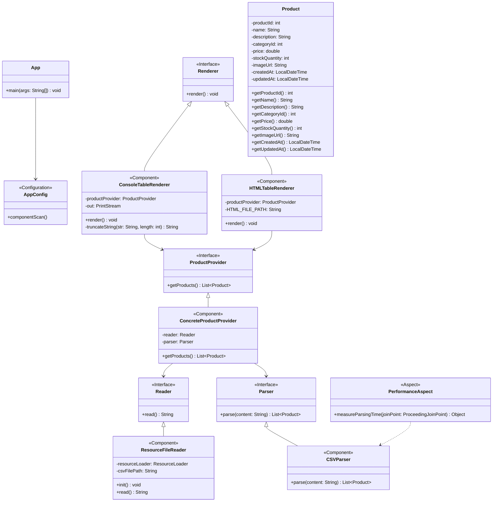

# Отчет о лабораторной работе 2

## Цель работы
- Переконфигурирование приложения Spring c помощью аннотаций
- Применение аспектно-ориентированного программирования (АОП) для логирования и измерения производительности
- Создание HTML-представления таблицы с товарами

## Выполнение работы
### 1. Перенос проекта из предыдущей лабораторной работы:
- Скопирован проект из лабораторной работы №1 в директорию `/les04/lab/`
- Сохранена вся структура проекта и зависимости

### 2. Переконфигурирование приложения с помощью аннотаций:
- Заменены конфигурации в XML на аннотации `@Component` для всех компонентов приложения
- Добавлена конфигурация с помощью класса `AppConfig` с аннотацией `@Configuration`
- Настроено автоматическое сканирование компонентов с помощью `@ComponentScan`

### 3. Настройка загрузки параметров из файла конфигурации:
- Создан конфигурационный файл `application.properties` в каталоге ресурсов
- Добавлено получение имени файла для загрузки продуктов с помощью аннотации `@Value` и SpEL
```java
@Value("${csv.file.path}")
private String csvFilePath;
```

### 4. Добавление HTML-рендерера таблицы:
- Реализован новый класс `HTMLTableRenderer`, реализующий интерфейс `Renderer`
- Настроено форматирование HTML-таблицы со стилями CSS

### 5. Отслеживание жизненного цикла бинов:
- Добавлен метод инициализации для бина `ResourceFileReader` с аннотацией `@PostConstruct`
- Реализован вывод в консоль даты и времени инициализации бина

### 6. Применение АОП для измерения производительности:
- Добавлены зависимости для работы с АОП Spring
- Создан аспект `PerformanceAspect` с аннотацией `@Aspect`
- Реализован метод для измерения времени выполнения парсинга CSV-файла:
```java
@Around("execution(* ru.bsuedu.cad.lab.parser.CSVParser.parse(..))")
public Object measureParsingTime(ProceedingJoinPoint joinPoint) throws Throwable {
    long startTime = System.currentTimeMillis();
    Object result = joinPoint.proceed();
    long endTime = System.currentTimeMillis();
    System.out.println("Время парсинга CSV-файла: " + (endTime - startTime) + " мс");
    return result;
}
```

### 7. Запуск приложения:
- Приложение успешно запускается командой `gradle run`
- Выводит информацию в консоль о времени парсинга и генерирует HTML-файл
- HTML-таблица успешно создается и отображает данные о продуктах


## UML-диаграмма классов



## Выводы
1. Успешно переконфигурировано Spring-приложение с использованием аннотаций, что упростило настройку компонентов
2. Освоены принципы внедрения значений из конфигурационных файлов с помощью `@Value` и SpEL
3. Изучен жизненный цикл бинов Spring и применение аннотаций жизненного цикла
4. Реализовано применение аспектно-ориентированного программирования для логирования и измерения производительности
5. Добавлена возможность представления данных в формате HTML-таблицы, что расширяет функциональность приложения
6. Приложение успешно запускается и выполняет все поставленные задачи

## Вопросы для защиты

1. **Виды конфигурирования ApplicationContext**  
   Spring поддерживает несколько способов конфигурирования контейнера ApplicationContext:  
   - **XML-конфигурация** — определение бинов и их связей в XML-файлах.  
   - **Аннотации (Java-based)** — использование аннотаций, таких как `@Component`, `@Configuration`, для автоматического сканирования и регистрации бинов.  
   - **Java-код (JavaConfig)** — конфигурация через классы с аннотацией `@Configuration` и методами с `@Bean`.  
   - **Groovy-конфигурация** — определение бинов с помощью Groovy-DSL.

2. **Стереотипные аннотации. Перечислите. Для чего используются?**  
   Стереотипные аннотации (`@Component`, `@Service`, `@Repository`, `@Controller`) используются для автоматической регистрации классов как бинов Spring. Они помогают разделять слои приложения и позволяют Spring автоматически обнаруживать и управлять этими классами.

3. **Инъекция зависимостей. Виды автоматического связывания.**  
   Виды автосвязывания:  
   - **По типу** — с помощью `@Autowired`, Spring ищет бин нужного типа.  
   - **По имени** — с помощью `@Qualifier`, указывается имя нужного бина.  
   - **Через конструктор** — зависимости передаются через параметры конструктора.  
   - **Через сеттер** — зависимости внедряются через сеттер-методы.

4. **Внедрение параметров. Как внедрить простые параметры в бин?**  
   Для внедрения простых значений (например, строки, числа) используют аннотацию `@Value("...")` или указывают параметры в файле `application.properties`, которые затем внедряются через `@Value` или с помощью механизма конфигурационных классов.

5. **Внедрение параметров с помощью SpEL**  
   SpEL (Spring Expression Language) позволяет внедрять вычисляемые значения с помощью выражений внутри `@Value`, например: `@Value("#{2 * 2}")` или `@Value("#{systemProperties['user.name']}")`.

6. **Режимы получения бинов**  
   Основные режимы (scopes) бинов:  
   - **Singleton** — один экземпляр на весь контейнер Spring (по умолчанию).  
   - **Prototype** — новый экземпляр при каждом запросе.  
   - Для web-приложений: **request** (один бин на HTTP-запрос), **session** (один бин на сессию пользователя).

7. **Жизненный цикл бинов**  
   Жизненный цикл включает: создание экземпляра, инициализацию (например, через методы с `@PostConstruct`), использование, уничтожение (например, через методы с `@PreDestroy`).

8. **Что такое АОП? Основные понятия**  
   АОП (аспектно-ориентированное программирование) — подход, позволяющий отделять сквозную функциональность (например, логирование, безопасность) от основной логики. Основные понятия:  
   - **Аспект** — модуль сквозной функциональности.  
   - **Advice** — действие, выполняемое в определённый момент.  
   - **Pointcut** — определяет, где применяется advice.  
   - **Join point** — точка в программе, где может быть применён advice.  
   - **Weaving** — процесс внедрения аспектов в код.

9. **Типы АОП в Spring**  
   - **Spring AOP** — работает на основе прокси-объектов во время выполнения (runtime).  
   - **AspectJ** — поддерживает внедрение аспектов на этапе компиляции, загрузки класса или выполнения (compile-time, load-time, runtime weaving).

10. **Виды Advice**  
    - **Before** — до выполнения метода.  
    - **After** — после выполнения метода (в любом случае).  
    - **AfterReturning** — после успешного завершения метода.  
    - **AfterThrowing** — после выбрасывания исключения.  
    - **Around** — обёртка вокруг метода, позволяет контролировать выполнение.

11. **Виды Point Cut**  
    Pointcut может определяться по:  
      - имени метода,  
      - аннотациям,  
      - пакетам или классам,  
      - аргументам метода.

12. **Чем Spring AOP отличается от AspectJ?**  
    - **Spring AOP** работает только с бинами Spring и реализует аспекты через динамические прокси, что ограничивает его область применения.  
    - **AspectJ** внедряет аспекты на уровне байткода, не ограничен только Spring и поддерживает более широкий набор возможностей и типов join points. 