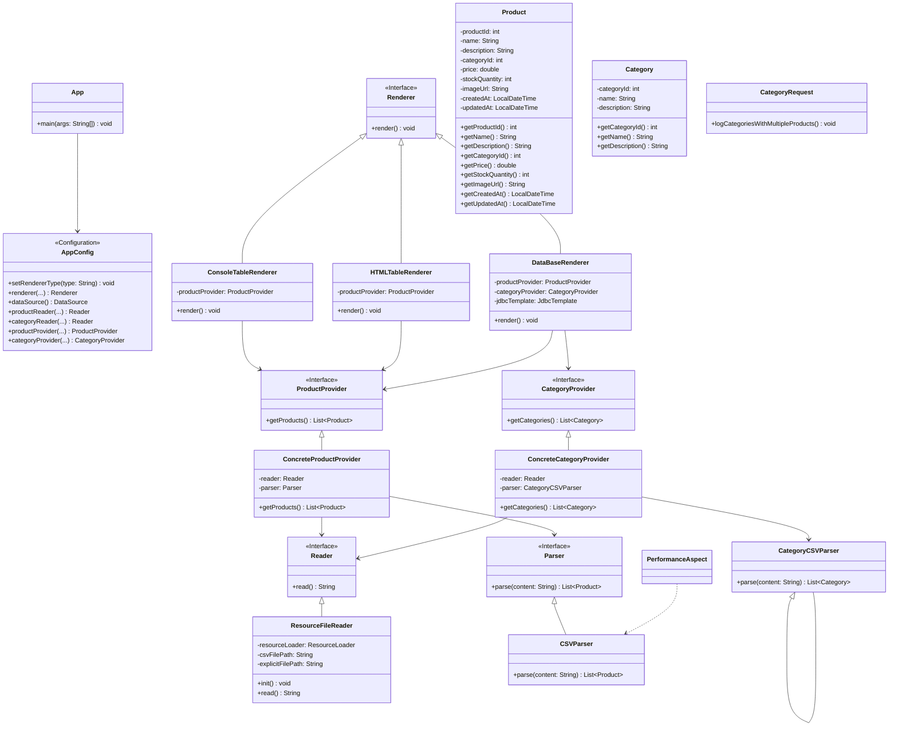

# Отчет о лабораторной работе 3

## Цель работы
- Научиться сохранять и извлекать данные из базы данных с помощью Spring JDBC и H2.
- Реализовать загрузку данных из CSV, их сохранение в БД и выполнение SQL-запросов с логированием.
- Освоить работу с DataSource, JdbcTemplate, EmbeddedDatabaseBuilder, RowMapper.

## Выполнение работы

### 1. Копирование проекта из предыдущей лабораторной работы
- Скопирован проект из лабораторной работы №2 в директорию `/les06/lab/`.
- Сохранена структура проекта и все необходимые зависимости.

### 2. Подключение встраиваемой базы данных H2 с помощью EmbeddedDatabaseBuilder
- В конфигурационном классе `AppConfig` создан бин `DataSource` с использованием `EmbeddedDatabaseBuilder` и типом H2.
- Пример кода:
  ```java
  @Bean
  public DataSource dataSource() {
      return new EmbeddedDatabaseBuilder()
              .setType(EmbeddedDatabaseType.H2)
              .addScript("classpath:schema.sql")
              .build();
  }
  ```

### 3. SQL-скрипт для создания таблиц "Продукты" (PRODUCTS) и "Категории" (CATEGORIES)
- В `src/main/resources/schema.sql` реализован скрипт создания таблиц с внешним ключом:
  ```sql
  CREATE TABLE CATEGORIES (
      category_id INT PRIMARY KEY,
      name VARCHAR(255) NOT NULL,
      description VARCHAR(1024)
  );

  CREATE TABLE PRODUCTS (
      product_id INT PRIMARY KEY,
      name VARCHAR(255) NOT NULL,
      description VARCHAR(1024),
      category_id INT,
      price DECIMAL(10,2),
      stock_quantity INT,
      image_url VARCHAR(1024),
      created_at TIMESTAMP,
      updated_at TIMESTAMP,
      CONSTRAINT fk_category FOREIGN KEY (category_id) REFERENCES CATEGORIES(category_id)
  );
  ```

### 4. Настройка EmbeddedDatabaseBuilder для выполнения скрипта при старте приложения
- В бин `DataSource` добавлен `.addScript("classpath:schema.sql")`, что обеспечивает автоматическое создание таблиц при запуске.

### 5. Класс Category и ConcreteCategoryProvider для загрузки категорий из CSV
- Создан класс `Category` для моделирования сущности категории.
- Реализован интерфейс `CategoryProvider` и его реализация `ConcreteCategoryProvider`, которая использует отдельный бин `Reader` для чтения файла `category.csv`.
- Файл `category.csv` размещен в `src/main/resources`.

### 6. Реализация DataBaseRenderer для сохранения данных из CSV в БД
- Создан класс `DataBaseRenderer`, реализующий интерфейс `Renderer`.
- В нем реализовано сохранение данных из CSV-файлов в таблицы базы данных с помощью `JdbcTemplate`.
- DataBaseRenderer может быть выбран как основной рендерер через аргумент запуска.

### 7. Класс CategoryRequest для выполнения SQL-запроса и логирования через logback
- Реализован класс `CategoryRequest`, который выполняет SQL-запрос для получения списка категорий, в которых больше одного товара.
- Результаты выводятся в лог на уровне INFO с помощью logback.
- Вызов логирования осуществляется только при передаче специального аргумента (`--log-categories` или `--log`).

### 8. Запуск приложения и вывод информации
- Приложение запускается командой:
  ```
  gradlew :app:run
  ```
- По умолчанию используется консольный рендерер.
- Для логирования категорий с количеством товаров больше единицы используйте:
  ```
  gradlew :app:run --args="--log-categories"
  ```
- Приложение успешно выводит информацию о продуктах и категориях, а также результаты SQL-запроса в лог.

### 9. UML-диаграмма классов



## Выводы

1. Реализовано подключение и автоматическая инициализация встраиваемой базы данных H2.
2. Данные из CSV-файлов успешно загружаются и сохраняются в БД.
3. Реализован SQL-запрос с логированием результата через logback.
4. Приложение поддерживает разные режимы рендеринга (консоль, HTML, база данных).
5. Все этапы лабораторной работы выполнены в полном объеме.

## Вопросы для защиты

1. **Что такое Spring JDBC и какие преимущества оно предоставляет по сравнению с традиционным JDBC?**
   - Spring JDBC — это модуль Spring, упрощающий работу с базой данных через JDBC. Он избавляет от рутины (открытие/закрытие соединений, обработка SQLException), делает код чище и безопаснее, поддерживает шаблоны для типовых операций.

2. **Какой основной класс в Spring используется для работы с базой данных через JDBC?**
   - Основной класс — `JdbcTemplate`. Он инкапсулирует всю работу с JDBC и предоставляет удобные методы для запросов, обновлений и работы с транзакциями.

3. **Какие шаги необходимо выполнить для настройки JDBC в Spring-приложении?**
   - Подключить зависимость spring-jdbc, создать бин DataSource, создать бин JdbcTemplate, использовать JdbcTemplate для работы с БД.

4. **Что такое JdbcTemplate и какие основные методы он предоставляет?**
   - `JdbcTemplate` — это класс-обёртка для JDBC. Основные методы: `query`, `queryForObject`, `update`, `batchUpdate` и др.

5. **Как в Spring JDBC выполнить запрос на выборку данных (SELECT) и получить результат в виде объекта?**
   - Использовать метод `query` или `queryForObject` с передачей SQL, параметров и RowMapper для преобразования строки результата в объект.

6. **Как использовать RowMapper в JdbcTemplate?**
   - RowMapper — это интерфейс для преобразования строки результата ResultSet в объект. Его можно реализовать явно или использовать лямбду прямо в методе `query`.

7. **Как выполнить вставку (INSERT) данных в базу с использованием JdbcTemplate?**
   - Вызвать метод `update` с SQL и параметрами, например: `jdbcTemplate.update("INSERT INTO ...", param1, param2, ...)`.

8. **Как выполнить обновление (UPDATE) или удаление (DELETE) записей через JdbcTemplate?**
   - Аналогично вставке: использовать метод `update` с нужным SQL и параметрами.

9. **Как в Spring JDBC обрабатывать исключения, возникающие при работе с базой данных?**
   - Spring JDBC автоматически преобразует SQLException в иерархию DataAccessException, которую проще обрабатывать и логировать.

10. **Какие альтернативные способы работы с базой данных есть в Spring кроме JdbcTemplate?**
    - Spring Data JPA (Hibernate), Spring Data MongoDB, Spring Data JDBC, Spring R2DBC (reactive), а также интеграция с MyBatis, Jooq и др. 