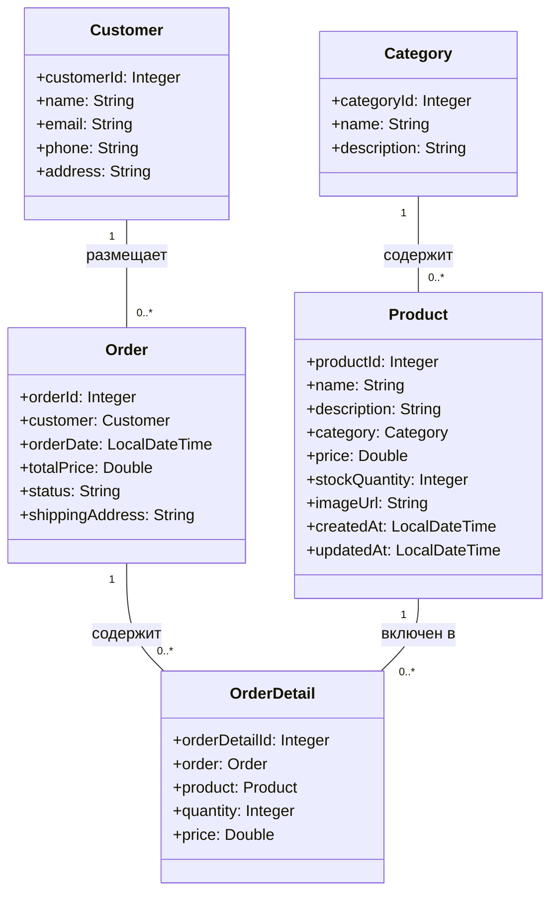

# Отчет о лабораторной работе 4

## Цель работы

- Освоить работу с JPA, Hibernate и Spring Data JPA для хранения и обработки данных в реляционной базе.
- Научиться строить слоистую архитектуру приложения с использованием репозиториев, сервисов и JPA-сущностей.
- Реализовать создание заказа с деталями и транзакционное сохранение в базу данных.

## Выполнение работы

### 1. Копирование и реорганизация проекта

- Проект скопирован из предыдущей лабораторной работы.
- Структура приведена к слоистой архитектуре:
  - `entity` — JPA-сущности
  - `repository` — Spring Data JPA репозитории
  - `service` — бизнес-логика (OrderService)
  - `app` — клиент для демонстрации работы

### 2. Настройка JPA, Hibernate и H2

- В `AppConfig` добавлены настройки JPA, Hibernate и HikariCP.
- Используется in-memory база H2 (`jdbc:h2:mem:testdb`).
- Включена автоматическая генерация схемы на основе JPA-сущностей.

### 3. Реализация JPA-сущностей

- Созданы классы-сущности: `Category`, `Product`, `Customer`, `Order`, `OrderDetail` с нужными связями и аннотациями.
- Все связи между сущностями реализованы через JPA (`@ManyToOne`, `@OneToMany`).

### 4. Реализация Spring Data репозиториев

- Для каждой сущности создан интерфейс-репозиторий, расширяющий `JpaRepository`.
- Репозитории автоматически реализуются Spring Data JPA.

### 5. Реализация сервисного слоя

- В пакете `service` создан сервис `OrderService` с методами:
  - `createOrder` — создание заказа с деталями (транзакционно)
  - `getAllOrders` — получение всех заказов

### 6. Реализация клиентского приложения

- В пакете `app` создан класс `OrderAppClient`, который:
  - Создаёт и сохраняет связанные сущности (категория, продукт, клиент)
  - Создаёт заказ и детали заказа через сервис
  - Явно проверяет, что заказ сохранён в базе (выводит результат в консоль)

### 7. Демонстрация работы

- Приложение запускается командой:
  
  ```powershell
  gradlew clean run
  ```

- В консоли выводится:
  - Информация о созданном заказе
  - Количество заказов в базе
  - Явное подтверждение, что заказ найден в базе данных

### 9. UML-диаграмма классов



## Выводы

1. Реализовано полноценное приложение с использованием JPA, Hibernate и Spring Data JPA.
2. Все сущности и связи соответствуют ER-диаграмме.
3. Создание заказа происходит транзакционно, с сохранением всех связанных данных.
4. Вся служебная информация скрыта, в консоли только пользовательский вывод.
5. Работа приложения полностью соответствует требованиям лабораторной работы.

## Вопросы для защиты

### JPA

1. **Что такое JPA и для чего оно используется?**  
   JPA — это спецификация для ORM в Java, позволяет работать с реляционными БД через объекты.

2. **Чем JPA отличается от Hibernate?**  
   JPA — стандарт, Hibernate — одна из реализаций JPA.

3. **Что делает аннотация @Entity?**  
   Помечает класс как JPA-сущность (таблицу в БД).

4. **Для чего нужна аннотация @Table?**  
   Позволяет явно указать имя таблицы для сущности.

5. **Как обозначить первичный ключ в JPA?**  
   С помощью аннотации `@Id`.

6. **Что делает аннотация @GeneratedValue?**  
   Указывает стратегию генерации значения первичного ключа.

7. **Какие бывают стратегии генерации идентификаторов в JPA?**  
   AUTO, IDENTITY, SEQUENCE, TABLE.

8. **Чем отличается @Column(name = "field_name") от использования имени поля напрямую?**  
   Позволяет явно указать имя столбца в таблице, если оно отличается от имени поля.

9. **Как задать связь “один ко многим” (@OneToMany) в JPA?**  
   Через аннотацию `@OneToMany` и соответствующее поле-коллекцию.

10. **Как задать связь “многие ко многим” (@ManyToMany) в JPA?**  
    Через аннотацию `@ManyToMany` и промежуточную таблицу.

### Spring Data

1. **Что такое Spring Data и зачем оно нужно?**  
   Упрощает работу с БД, автоматически реализует репозитории.

2. **Что делает интерфейс CrudRepository?**  
   Предоставляет базовые CRUD-операции для сущностей.

3. **Чем JpaRepository отличается от CrudRepository?**  
   JpaRepository расширяет CrudRepository и добавляет методы для работы с JPA (например, пагинация, сортировка).

4. **Как создать свой репозиторий в Spring Data JPA?**  
   Создать интерфейс, расширяющий JpaRepository или CrudRepository.

5. **Как выполнить поиск по ID с помощью Spring Data JPA?**  
   Использовать метод `findById(id)`.

6. **Как добавить новую запись в базу данных через Spring Data JPA?**  
   Вызвать метод `save(entity)` у репозитория.

7. **Как удалить объект из базы данных в Spring Data JPA?**  
   Вызвать метод `delete(entity)` или `deleteById(id)`.

8. **Как написать свой SQL-запрос в Spring Data JPA?**  
   Использовать аннотацию `@Query` в интерфейсе репозитория.

9. **Что такое @Transactional и зачем она нужна?**  
   Обеспечивает выполнение метода в рамках транзакции.

10. **Какие аннотации нужны для работы с JPA-сущностями?**  
    @Entity, @Table, @Id, @GeneratedValue, @Column, @ManyToOne, @OneToMany и др.