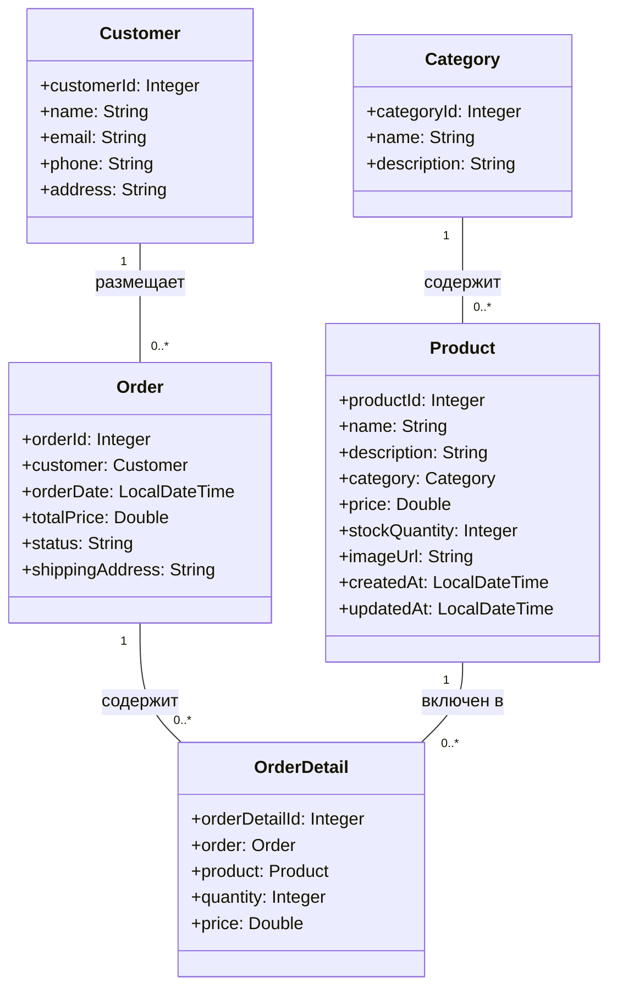

# Отчет о лабораторной работе 5

## Цель работы

- Освоить разработку и развертывание Web-приложений на Java с использованием сервлетов и Spring Data JPA.
- Научиться реализовывать web-интерфейс для управления заказами и REST API для получения информации о продуктах.
- Реализовать создание заказа.

## Выполнение работы

### 1. Копирование и подготовка проекта

- Проект скопирован из предыдущей лабораторной работы и размещён в директории `/les10/lab/`.
- Структура проекта:
  - `entity` — JPA-сущности
  - `repository` — Spring Data JPA репозитории
  - `service` — бизнес-логика (OrderService)
  - `app` — сервлеты и web-интерфейс

### 2. Установка и настройка Apache Tomcat 11

- Apache Tomcat 11 скачан и установлен с официального сайта.
- Добавлен пользователь с правами администратора для деплоя через web-интерфейс.
- Проект настроен на сборку WAR-файла для деплоя на Tomcat.

### 3. Реализация web-интерфейса для заказов

- Создан сервлет `/orders`, отображающий список заказов с подробной информацией о клиенте и заказе.
- Добавлена кнопка для перехода на форму создания заказа.
- Создан сервлет `/create-order` с формой для создания заказа:
  - В начале формы — выбор типа клиента (новый/существующий) с помощью radio-кнопок.
  - Если выбран новый клиент — отображаются поля для ввода данных клиента.
  - Если выбран существующий — появляется выпадающий список клиентов из БД.
  - Реализован множественный выбор продуктов (select multiple), выбранные продукты добавляются в заказ.
  - Итоговая сумма заказа рассчитывается автоматически по выбранным продуктам.

### 4. Реализация REST-сервиса для продуктов

- Создан REST-сервлет `/api/products`, возвращающий список продуктов в формате JSON.
- Для каждого продукта выводится: название, категория, количество на складе.
- REST-сервис протестирован с помощью Postman.

### 5. Импорт данных из CSV

- При запуске приложения данные из файлов `category.csv`, `customer.csv`, `product.csv` автоматически импортируются в базу данных.
- Для этого реализован компонент DataInitializer, который парсит CSV и сохраняет сущности через репозитории.

### 6. Сборка и деплой

- Приложение собрано командой:
  ```
  gradle war
  ```
- WAR-файл успешно задеплоен на сервер Apache Tomcat 11.
- Web-интерфейс и REST-сервис работают корректно.

### 7. UML-диаграмма классов



## Выводы

1. Реализовано web-приложение с полноценным web-интерфейсом для управления заказами и REST API для продуктов.
2. Пользователь может создавать заказы с выбором клиента и нескольких продуктов.
3. Данные импортируются из CSV-файлов автоматически при запуске.
4. Приложение успешно деплоится на Tomcat 11 и соответствует требованиям лабораторной работы.

## Вопросы для защиты

### Web и сервлеты

1. **Что такое Servlet и зачем он нужен?**  
   Это Java-класс для обработки HTTP-запросов и генерации ответов, основа web-приложений на Java.
2. **Что делает web.xml и зачем он нужен в веб-приложении?**  
   Описывает конфигурацию сервлетов, фильтров, слушателей и маппинг URL.
3. **Что такое WAR-файл и чем он отличается от JAR?**  
   WAR — архив web-приложения для деплоя на сервер, JAR — обычная библиотека или приложение.
4. **Что такое ServletContext и как его использовать?**  
   Это объект-контекст приложения, позволяет хранить и получать общие данные между сервлетами.
5. **Чем отличается HttpServletRequest от HttpServletResponse?**  
   Первый — запрос клиента, второй — ответ сервера.
6. **Какой интерфейс нужно реализовать, чтобы создать Listener, реагирующий на запуск приложения?**  
   ServletContextListener.
7. **Как получить доступ к Spring ApplicationContext внутри обычного сервлета?**  
   Через WebApplicationContextUtils.getRequiredWebApplicationContext(getServletContext()).
8. **Что делает ContextLoaderListener в Spring-приложении?**  
   Инициализирует Spring ApplicationContext при запуске web-приложения.
9. **Зачем нужно использовать @WebServlet и чем он лучше/хуже конфигурации в web.xml?**  
   Упрощает регистрацию сервлетов, но web.xml даёт больше гибкости для сложных конфигураций.
10. **Как можно использовать один Spring Bean в нескольких сервлетах?**  
    Получать его из ApplicationContext или внедрять через DI.
