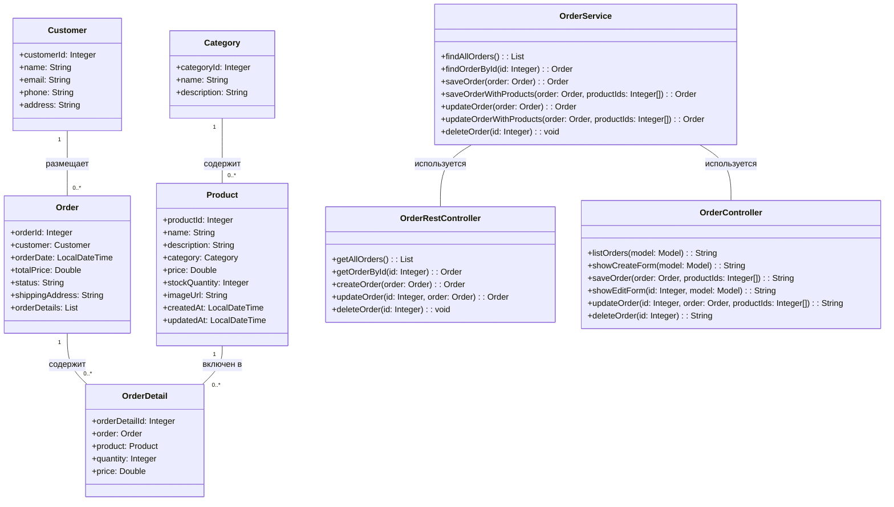

# Отчет о лабораторной работе 6

## Цель работы

- Освоить разработку веб-приложений с использованием технологии Spring MVC.
- Научиться реализовывать REST API для работы с заказами.
- Создать пользовательский интерфейс с помощью шаблонизатора Thymeleaf.

## Выполнение работы

### 1. Копирование и подготовка проекта

- Проект скопирован из предыдущей лабораторной работы в директорию `/les12/lab/`.
- Структура проекта сохранена:
  - `entity` — JPA-сущности
  - `repository` — Spring Data JPA репозитории
  - `service` — бизнес-логика (OrderService)
  - `controller` — контроллеры Spring MVC (REST и обычные)

### 2. Настройка Spring MVC

- В `build.gradle.kts` добавлены зависимости для Spring MVC, Jackson и Thymeleaf.
- Создан класс конфигурации `AppConfig` с аннотацией `@EnableWebMvc`.
- Настроен `DispatcherServlet` в файле `web.xml` для обработки всех запросов.

### 3. Реализация REST API для заказов

- Создан `OrderRestController` с методами для CRUD-операций.
- Добавлены маппинги для всех необходимых операций: GET, POST, PUT, DELETE.
- Для решения проблемы с параметрами `@PathVariable` в build.gradle.kts добавлен флаг компилятора `-parameters`.

### 4. Деплой и тестирование REST API

- Приложение собрано и задеплоено на Apache Tomcat 11.
- REST API протестирован с помощью Postman.
- Создана коллекция запросов для тестирования всех CRUD-операций.

### 5. Подключение Thymeleaf и реализация веб-интерфейса

- Настроены необходимые бины для Thymeleaf в `AppConfig`: templateResolver, templateEngine, viewResolver.
- Создан `OrderController` для обработки запросов веб-интерфейса.
- Разработаны HTML-шаблоны на Thymeleaf:
  - `orders.html` — список всех заказов
  - `order-form.html` — форма для создания и редактирования заказов
- Реализованы все необходимые операции: получение списка заказов, создание, редактирование и удаление.
- В форму заказа добавлены улучшения: datepicker, выпадающие списки, мультиселект для товаров с автоматическим расчётом суммы.
- Решена проблема с обновлением связи Order-OrderDetail при редактировании заказа.

### 6. Сборка приложения

- Приложение собрано с помощью команды `gradle war`.
- WAR-файл подготовлен для деплоя на сервер Tomcat.

### 7. Деплой и тестирование приложения

- WAR-файл успешно задеплоен на сервер Apache Tomcat 11.
- Проверена работа веб-интерфейса и REST API.
- Все функции работают корректно: просмотр, создание, редактирование и удаление заказов.

### 8. UML-диаграмма классов

## Выводы

1. Реализовано веб-приложение для магазина зоотоваров с использованием Spring MVC и Thymeleaf.
2. Разработан REST API для управления заказами, позволяющий получать список заказов, получать заказ по идентификатору, создавать, удалять и изменять заказы.
3. Создан пользовательский веб-интерфейс на Thymeleaf для работы с заказами.
4. Приложение успешно собрано и развернуто на сервере Apache Tomcat 11.

## Вопросы для защиты

### Spring MVC

1. **Что означает аббревиатура MVC и каковы её основные компоненты?**  
   MVC (Model-View-Controller) — архитектурный паттерн, разделяющий приложение на три компонента: Model (данные и бизнес-логика), View (представление данных пользователю), Controller (обработка запросов).

2. **Какую роль выполняет DispatcherServlet в Spring MVC?**  
   DispatcherServlet — центральный компонент (Front Controller), который перехватывает все HTTP-запросы и направляет их к соответствующим контроллерам.

3. **Какая аннотация используется для указания, что класс является контроллером?**  
   Аннотация @Controller используется для обозначения класса как контроллера в Spring MVC.

4. **Чем отличаются аннотации @Controller и @RestController?**  
   @Controller — класс обрабатывает запросы и возвращает имя представления для отображения.
   @RestController — объединяет @Controller и @ResponseBody, возвращая данные напрямую в формате JSON/XML.

5. **Какой аннотацией можно связать параметр метода с переменной из URL (например, /users/{id})?**  
   Аннотация @PathVariable используется для извлечения значений переменных из URL.

6. **Что такое Model в Spring MVC и как она используется?**  
   Model — это контейнер для данных, которые будут использоваться при рендеринге представления. Данные добавляются в модель с помощью метода addAttribute().

7. **Что делает аннотация @RequestMapping?**  
   @RequestMapping связывает HTTP-запросы с методами-обработчиками по URL, HTTP-методу и другим атрибутам.

8. **Какие HTTP-методы можно обрабатывать в Spring MVC и какими аннотациями?**  
   GET — @GetMapping, POST — @PostMapping, PUT — @PutMapping, DELETE — @DeleteMapping, PATCH — @PatchMapping, Все — @RequestMapping.

9. **Что такое ViewResolver и зачем он нужен в Spring MVC?**  
   ViewResolver определяет, какой шаблон использовать для отображения результатов обработки запроса. Он преобразует строковое имя представления в конкретный объект View.

10. **Как вернуть JSON из контроллера без использования шаблонов?**  
    Использовать аннотацию @ResponseBody на методе контроллера или использовать @RestController на уровне класса.
