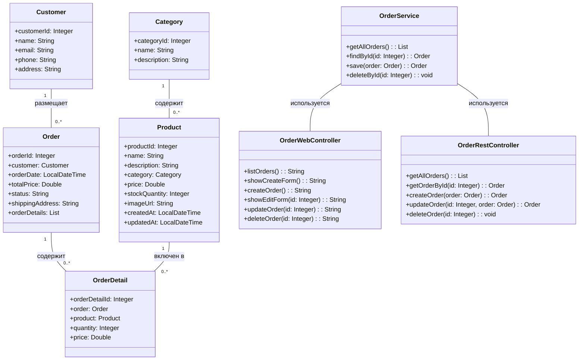

# Отчет о лабораторной работе 7

## Цель работы

- Настроить Spring Security для проекта веб-приложения Zoo-Shop.
- Реализовать роль-базированный доступ: пользователь (USER) и менеджер (MANAGER).
- Добавить form-based аутентификацию и авторизацию для пользовательского интерфейса.
- Добавить Basic Authentication для REST API и разграничить доступ.
- Собрать и задеплоить приложение на Apache Tomcat.

## Выполнение работы

### 1. Копирование и подготовка проекта

- Скопировал результат лабораторной работы №6 в директорию `/les14/lab/`.

### 2. Настройка проекта для работы со Spring Security

- В `build.gradle.kts` добавлены зависимости:
  - `spring-security-web`
  - `spring-security-config`
  - `thymeleaf-extras-springsecurity6`
- Создан класс `SecurityInitializer` для регистрации цепочки фильтров.
- Создан класс `SecurityConfig` с бинами `SecurityFilterChain` и базовой настройкой Spring Security.

### 3. Добавление пользователей и разграничение ролей

- В `SecurityConfig` определен бин `UserDetailsService` (InMemoryUserDetailsManager) с двумя пользователями:
  - `user` (роль `USER`)
  - `manager` (роль `MANAGER`)
- Настроены запросы:
  - UI: просмотр `/orders/**` только для `USER` и `MANAGER`, изменение — только для `MANAGER`.
  - REST: все запросы `/api/**` требуют аутентификации, GET для `USER`, остальные методы — для `MANAGER`.

### 4. Form-based аутентификация для UI

- Настроена форма входа на `/login`, добавлен контроллер `LoginController` и шаблон `login.html`.
- Установлена перенаправление на `/orders` после успешного входа.
- Добавлены кнопки и ограничения:
  - Отображение текущего пользователя (Thymeleaf #authentication.name).
  - Кнопка "Выйти" (`/logout`).
  - Для `USER` кнопки "Создать", "Редактировать", "Удалить" неактивны.

### 5. Basic Authorization для REST

- В `SecurityConfig` включен `httpBasic()` для `/api/**`, отключены `formLogin` и `csrf`.
- Добавлен `OpenEntityManagerInViewFilter` через `web.xml` для ленивой инициализации сущностей.

### 6. Сборка приложения

- Выполнена команда `gradle war` для генерации WAR-архива.

### 7. Деплой и тестирование приложения

- WAR-файл развернут на Apache Tomcat 11.
- Проверены:
  - UI: вход под `user` и `manager`, ограничения доступа работают.
  - REST: Basic Auth, ограничения методов для ролей.

## UML-диаграмма классов

## Выводы

1. Реализована полноценная аутентификация и авторизация с использованием Spring Security.
2. Настроены form-based login и Basic Authentication для REST с разделением ролей.
3. Приложение успешно собрано и задеплоено на Tomcat, ограничения доступа работают корректно.

## Вопросы для защиты

1. **Что такое Spring Security и зачем он используется?**
   Spring Security — это фреймворк для аутентификации, авторизации и защиты от распространенных веб-атак.

2. **Чем отличается аутентификация от авторизации?**
   Аутентификация — проверка личности пользователя, авторизация — проверка прав доступа.

3. **Что такое SecurityFilterChain и какова его роль в приложении?**
   SecurityFilterChain — цепочка фильтров, обрабатывающих запросы для выполнения авторизации и аутентификации.

4. **Как работает form-based аутентификация в Spring Security?**
   Форма на `/login` отправляет credentials, `UsernamePasswordAuthenticationFilter` их обрабатывает и сохраняет `Authentication` в контексте.

5. **Что такое UserDetailsService и зачем он нужен?**
   UserDetailsService — интерфейс для загрузки данных пользователя (UserDetails) по имени пользователя.

6. **Как задать роли пользователям и проверять их в коде?**
   Роли задаются в UserDetails (например, `.roles("USER")`), проверяются через `.hasRole(...)` или `sec:authorize`.

7. **Что такое Basic Authentication и когда её удобно использовать?**
   Basic Auth — передача логина и пароля в заголовке HTTP; удобно для REST или микросервисов.

8. **Как запретить доступ к URL-адресу без соответствующей роли?**
   Через конфигурацию `authorizeHttpRequests().requestMatchers(...).hasRole("...")`.

9. **Как сделать свою страницу для входа (custom login page)?**
   Через настройку `formLogin().loginPage("/login")` и создание контроллера/шаблона `login.html`.

10. **Можно ли использовать одновременно form login и basic auth в одном проекте?**
    Да, можно настроить оба механизма в одном SecurityFilterChain.
