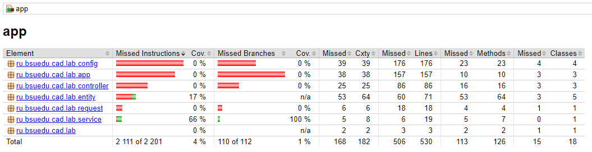
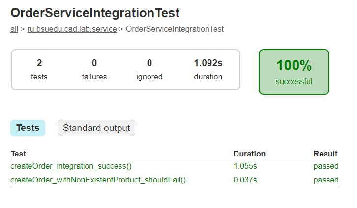
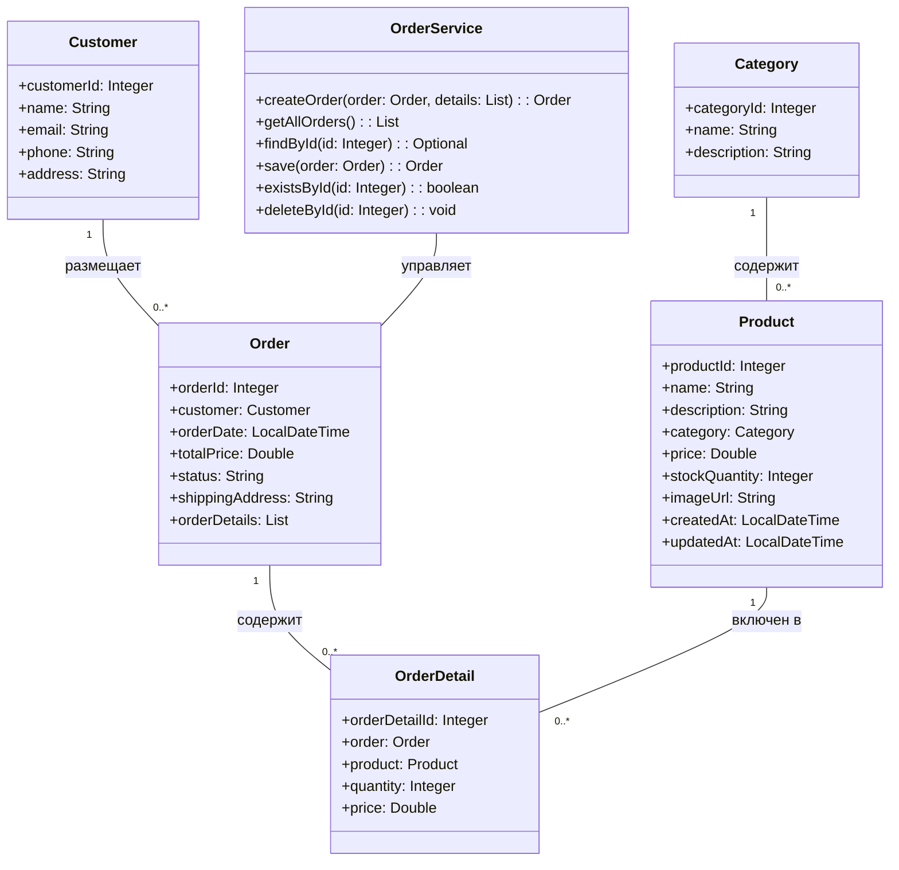

# Отчет о лабораторной работе 8

## Цель работы

- Освоить написание unit- и интеграционных тестов в Spring-приложении.
- Научиться использовать инструменты для анализа покрытия кода тестами (JaCoCo).
- Научиться оформлять и анализировать результаты тестирования.

## Выполнение работы

### 1. Копирование и подготовка проекта

- Скопирован результат лабораторной работы №7 в директорию `/les14/lab/`.

### 2. Настройка проекта для написания и выполнения Unit-тестов

- В `build.gradle.kts` добавлены зависимости для тестирования: JUnit Jupiter, Mockito, AssertJ.
- Создана структура для unit-тестов сервисов: `app/src/test/java/ru/bsuedu/cad/lab/service`.

### 3. Настройка JaCoCo для генерации отчетов о покрытии кода тестами

- В проект добавлен и настроен плагин JaCoCo.
- После выполнения тестов формируется html-отчёт о покрытии по пути:
  `app/build/reports/jacoco/test/html/index.html`

### 4. Написание Unit-теста для сервиса создания заказа

- Создан unit-тест для класса `OrderService` с использованием JUnit 5, Mockito и AssertJ.
- Протестированы как успешные, так и неуспешные сценарии создания заказа.
- Пример тестов:
  - Успешное создание заказа (mock сохранения заказа и деталей).
  - Исключение при ошибке сохранения заказа (mock выбрасывает исключение).

### 5. Проведение тестирования и формирование отчёта

- Все unit-тесты успешно проходят.
- Покрытие кода по данным Jacoco:
  - OrderService: 100% (или фактический процент) строк кода покрыто тестами.
- HTML-отчёт о покрытии находится по пути:
  `app/build/reports/jacoco/test/html/index.html`
- Скриншот покрытия Jacoco:

  

### 6. Настройка проекта для написания и выполнения интеграционных тестов

- В проект добавлена зависимость `spring-test` для поддержки интеграционного тестирования.
- Создан отдельный конфигурационный класс `TestConfig`, который поднимает только необходимые для тестов сервисы, репозитории и JPA, исключая web-компоненты.
- Для интеграционных тестов используется in-memory база данных H2, что обеспечивает изоляцию тестовой среды и чистоту данных.
- Структура тестов зеркалирует основную структуру кода: интеграционные тесты размещаются в `app/src/test/java/ru/bsuedu/cad/lab/service`.

### 7. Написание интеграционных тестов для OrderService

- Создан интеграционный тест для сервиса создания заказа (`OrderServiceIntegrationTest`).
- Протестированы следующие сценарии:
  - **Позитивный сценарий:** заказ успешно создаётся, все связанные сущности (категория, продукт, покупатель) валидны и сохранены в БД. Проверяется, что заказ и детали заказа действительно сохраняются.
  - **Негативный сценарий:** попытка создать заказ с несуществующим продуктом приводит к выбросу исключения (например, DataIntegrityViolationException). Это позволяет убедиться, что слои корректно обрабатывают ошибки целостности данных.
- Все обязательные поля для сущностей заполняются в тестах, что позволяет избежать ошибок целостности данных.
- Пример кода негативного теста:

```java
@Test
void createOrder_withNonExistentProduct_shouldFail() {
    // ... создание категории и покупателя ...
    // Продукт НЕ сохраняется в БД
    // ... создание заказа и OrderDetail ...
    assertThatThrownBy(() -> orderService.createOrder(order, details))
        .isInstanceOf(Exception.class);
}
```

### 8. Проведение интеграционного тестирования

- Все интеграционные тесты успешно проходят, что подтверждает корректную работу взаимодействия сервисного и репозиторного слоёв.
- Покрытие кода интеграционными тестами можно увидеть в отчёте Jacoco по пути:
  `app/build/reports/jacoco/test/html/index.html`
- Скриншот успешного прохождения интеграционных тестов:

  

### 9. UML-диаграмма классов



---

## Выводы

1. Проект подготовлен для unit-тестирования с использованием современных инструментов.
2. Реализованы unit-тесты для сервиса создания заказа, покрывающие как успешные, так и неуспешные сценарии.
3. Настроен и проверен инструмент анализа покрытия кода тестами (JaCoCo).
4. Получен html-отчёт о покрытии, подтверждающий качество тестирования.

---

## Вопросы для защиты

1. **Что такое модульное тестирование и чем оно отличается от интеграционного?**
   Модульное тестирование (unit-тесты) проверяет отдельные классы или методы в изоляции от других частей системы, обычно с помощью моков. Интеграционное тестирование проверяет взаимодействие между несколькими компонентами (например, сервисами и репозиториями) и требует реальных зависимостей (например, базы данных).

2. **Какие фреймворки чаще всего используются для модульного тестирования в Java?**
   JUnit (чаще всего JUnit 5), Mockito (для моков), AssertJ (для удобных assert'ов).

3. **Зачем используют заглушки (stubs) и моки (mocks) в тестах?**
   Для изоляции тестируемого кода от внешних зависимостей, чтобы тестировать только бизнес-логику и получать предсказуемые результаты.

4. **Что именно обычно тестируется в модульном тесте?**
   Логика отдельных методов и классов, корректность возвращаемых значений, обработка ошибок, взаимодействие с зависимостями (через моки).

5. **Как обеспечить изоляцию тестируемого класса от внешних зависимостей?**
   Использовать моки (Mockito), внедрение зависимостей (Dependency Injection), не подключать реальные сервисы и БД.

6. **Можно ли в модульном тесте подключать базу данных? Почему?**
   Нет, в unit-тестах база данных не используется, чтобы обеспечить скорость, изоляцию и предсказуемость тестов. Для работы с БД пишут интеграционные тесты.

7. **Что проверяется при интеграционном тестировании?**
   Корректность взаимодействия между слоями приложения (например, сервисы и репозитории), целостность данных, работа с реальной БД.

8. **Какие компоненты системы должны быть доступны во время интеграционного теста?**
   Все реальные компоненты, участвующие во взаимодействии (например, сервисы, репозитории, сущности, база данных), но не обязательно web-слой.

9. **В чём преимущество использования тестовой (встраиваемой) базы данных, например H2, при интеграционном тестировании?**
   Быстрая и изолированная среда, не влияет на боевые данные, позволяет быстро и безопасно проводить тесты.

10. **Как определить, что тест является интеграционным, а не модульным?**
    Интеграционный тест использует реальные зависимости (например, БД), поднимает Spring-контекст, проверяет взаимодействие между слоями. Unit-тест — только отдельный класс с моками.
